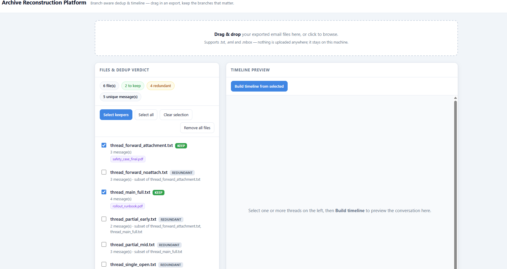
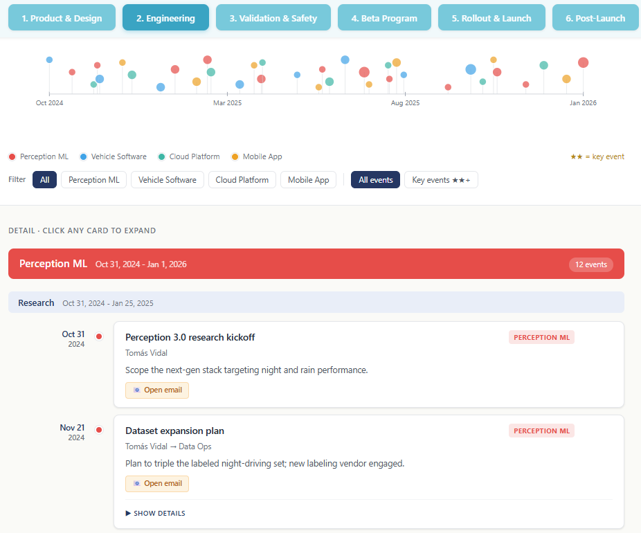

# Archive Reconstruction Platform

[](https://github.com/mermilke/archive-reconstruction-platform/actions/workflows/tests.yml)
[](https://www.python.org/downloads/)
[](LICENSE)
[](#requirements)

> **When a conversation forks, the biggest file isn't always a superset.** A
> smaller export can hold a reply — or an attachment — the big one never had.
> Naïvely "keep the largest, delete the rest" silently loses data. This toolkit
> compares the *content* of each export, not its size, so it only ever flags a
> file as redundant when every message and attachment it holds lives somewhere
> else. That branch-aware dedup is the core idea; everything else serves it.

A small, dependency-free Python toolkit that reconstructs a clean, deduplicated,
time-ordered view from a pile of **overlapping exported threads** — the mess you
get after archiving a mailbox or saving conversations one message at a time. The
engine is **source-agnostic**; its first input adapter is email (`.eml` /
`.mbox` / `.txt`), and anything else that can be reduced to "messages with
senders, bodies, and attachments" plugs into the same dedup and timeline core.

It does two things:

1. **dedup** — figures out which exported files are redundant copies of each
   other and which carry unique content, so duplicates can be safely deleted.
   **Branch-aware**: it reduces each file to a set of content keys (sender +
   body fingerprint, plus one per attachment) and calls a file redundant *only*
   when that set is a subset of another's — so a fork that hides a unique reply
   is never thrown away. It only ever **recommends** a delete list; it never
   deletes anything.
2. **timeline** — turns a list of events into a single self-contained,
   interactive HTML timeline grouped into tabs (e.g. by vendor, project, or
   correspondent).

There's a **command line**, a **local drag-drop web UI** (`arc web`), an
accumulating **SQLite store**, thread-tree reconstruction that *proves* dedup
loses no message, and an opt-in AI categorizer. Everything runs on the Python
**standard library** — no network, no services, no external assets in the
generated HTML, and nothing to `pip install` to use the core.

## Screenshots

<!--
  TODO (pre-publish): drop real images in docs/img/ and uncomment.
  Capture with `arc web` (the keep/delete panel) and an example timeline
  (`arc timeline examples/events.json -o timeline.html`).



-->

**Live demo:** **https://mermilke.github.io/archive-reconstruction-platform/**
— an interactive timeline rendered from the synthetic sample data, served as a
single self-contained page (no backend, no install). It's the file at
[`docs/index.html`](docs/index.html), regenerated with
`arc timeline examples/events.json -o docs/index.html`.

> To turn it on after pushing: repo **Settings → Pages → Build and deployment →
> Source: Deploy from a branch → `main` / `/docs` → Save**. The link goes live in
> a minute. (The drag-drop dedup UI, `arc web`, runs a local server and isn't
> part of the static demo — clone and run it to try that.)

## Requirements

- Python **3.9+** — **zero third-party packages** for everything in the core.

## Install

```sh
# From a clone (editable): gives you the `arc` command on your PATH
pip install -e .
arc --version
arc --help
```

Or run it straight from a clone without installing — see **Quick start** below.

## Quick start

```sh
# Recommend which exported thread files are redundant (nothing is deleted)
PYTHONPATH=src python -m arc.cli dedup examples/threads

# Rebuild the reply tree from threading headers and prove dedup loses no message
PYTHONPATH=src python -m arc.cli tree examples/raw_email

# Accumulate folders into a SQLite store across runs, then dedup/timeline from it
PYTHONPATH=src python -m arc.cli store add examples/threads --db arc.db
PYTHONPATH=src python -m arc.cli store dedup --db arc.db

# Build a self-contained, tabbed HTML timeline
PYTHONPATH=src python -m arc.cli timeline examples/events.json -o timeline.html

# Launch the local web UI: drag-drop an export, see keep/delete, pick threads,
# browse the timeline (stdlib http.server only — local, offline, opens a browser)
PYTHONPATH=src python -m arc.cli web

# Run the dedup correctness test
python tests/test_dedup.py
```

On Windows PowerShell, set `PYTHONPATH` like this:

```powershell
$env:PYTHONPATH="src"; python -m arc.cli dedup examples/threads
```

After `pip install -e .` (see [Install](#install)) the `arc` command is on your
PATH, so you can drop the `PYTHONPATH=src python -m arc.cli` prefix entirely and
just run `arc dedup examples/threads`, `arc web`, and so on. There's also a
one-shot test runner — `python tests/run_all.py` — and `make test` / `.\tasks.ps1 test`.

## How dedup works (the key idea)

Each file is reduced to a **set of content keys**:

- one key per **message** = sender + a fingerprint of the body.
  **Timestamps are deliberately ignored**, because the same message often
  renders with different times across exports (time-zone differences) and would
  otherwise look like two messages.
- one key per distinct **attachment** name.

A file is **redundant** only if its key-set is a *subset* of another file's
key-set. Files that aren't a subset of anything are the **branches** worth
keeping; together they preserve every message and attachment.

The tool only **recommends** a delete list — it never deletes anything.

See [DESIGN.md](DESIGN.md) for the full rationale, including why comparing file
sizes (the naive approach) breaks on forked threads.

## Example output

Running `dedup` on the six synthetic files in `examples/threads` keeps the two
branches and flags the four subsets:

```
KEEP (2 branch(es) - together these preserve every message and attachment):
  [keep] thread_forward_attachment.txt
  [keep] thread_main_full.txt

DELETE (4 redundant - each is a subset of a kept branch):
  [del]  thread_forward_noattach.txt   (subset of thread_forward_attachment.txt)
  [del]  thread_partial_early.txt      (subset of thread_main_full.txt, ...)
  [del]  thread_partial_mid.txt        (subset of thread_main_full.txt)
  [del]  thread_single_open.txt        (subset of thread_main_full.txt, ...)

Recommendation only - no files were deleted.
```

## Thread-export input format

Messages are stacked **newest-first**, each with a header block followed by a
blank line and then the body:

```
From: Raj Patel <raj.patel@voltera.example>
Sent: 2025-11-26 16:45
To: Lena Ortiz <lena.ortiz@voltera.example>
Subject: RE: Drive Assist 3.0 - canary go/no-go
Attachments: rollout_runbook.pdf

Body text here.
```

`Sent:` or `Date:` both work, and header keys are case-insensitive.

### Supported input formats

Folder commands (`dedup`, `timeline-threads`, `ingest`, `organize`) read these
by default — point them at a real mailbox export:

| Format | What it is |
|--------|------------|
| `.txt` | The stacked thread-export format above |
| `.eml` | A single exported email (Gmail/Outlook/Thunderbird "save as") |
| `.mbox`| A mailbox archive of many messages (Gmail Takeout, Thunderbird, Apple Mail) |

`.eml`/`.mbox` are read with the standard-library `email`/`mailbox` modules
(still zero-dependency); RFC 2047-encoded subjects, attachments, and HTML-only
bodies are handled. Pass `--pattern '*.eml'` to restrict to one format.

## Timeline data format

`timeline` reads a JSON file and produces a single self-contained HTML page:
sticky tabs, a collapsible **Summary** panel, an SVG **overview axis** (dots
placed by date, colored by category, sized by importance, with hover tooltips
and click-to-jump), a legend, optional **filters** (by category and "key events
only"), **groups** with optional **phases**, and expandable event cards (quote,
attachment chips, significance note). Importance `0–3` drives dot size, gold
borders, and star markers.

**Summary + Stats.** Each tab opens with a collapsible **Summary** panel: a
paragraph overview (the authored `"summary"` string if present, else generated)
plus a **Stats** row for the whole tab — event count, date span, categories, and
key-event count. This top panel is static and never changes with the filters.
When you **apply a filter**, a small stats-and-summary block appears **directly
beneath the overview axis** (above the detail list) describing just the current
selection — its category breakdown and the key milestones in view; with the
filters on "All" it stays hidden. Everything is computed in-browser, so the page
remains fully offline.

The rich form:

```json
{
  "title": "...",
  "subtitle": "...",
  "categories": [{ "id": "perception", "label": "Perception ML", "color": "#EF4444" }],
  "tabs": [{
    "id": "engineering", "label": "2. Engineering", "heading": "...",
    "description": "...", "filters": true,
    "summary": "Optional authored narrative shown in the top Summary panel.",
    "groups": [{
      "id": "perception", "label": "Perception ML", "category": "perception",
      "events": [{
        "date": "2025-03-25", "title": "...", "parties": "Tomás → Validation",
        "summary": "...", "importance": 3, "phase": "Hardening",
        "quote": "...", "significance": "...",
        "attachments": ["plain_chip.pdf", { "name": "linked.xlsx", "href": "files/linked.xlsx" }]
      }]
    }]
  }]
}
```

Attachments may be a bare string (a plain chip) or `{ "name", "href" }` (a
clickable chip — the only outbound link the page can contain). A **bare JSON
array** of `{ date, group, title, description }` events is also accepted and
rendered as a single tab. See [examples/events.json](examples/events.json).

## Project layout

```
src/arc/
  parse.py      parse exported thread text into Message objects
  dedup.py      reduce each file to a content-key set; subset = redundant
  timeline.py   self-contained HTML timeline grouped into tabs
  web.py        thin local web UI (stdlib http.server): drag-drop -> keep/delete -> timeline
  cli.py        `arc dedup <dir>` / `arc tree <dir>` / `arc store add|dedup|timeline|stats` / `arc timeline ...` / `arc web`
examples/
  threads/      6 synthetic files (2 branches + 4 subsets) proving the logic
  events.json   synthetic timeline data
tests/
  test_dedup.py asserts the 2 branches are kept and the 4 subsets are flagged
```

## Roadmap

See [ROADMAP.md](ROADMAP.md). Done: `.eml`/`.mbox` ingestion; a hardened parser
with messy fixtures (quoted replies, forwards, signatures, timezone duplicates,
malformed/folded headers); thread-tree reconstruction from `Message-ID` /
`In-Reply-To` / `References` that verifies dedup loses no message (`arc tree`);
a SQLite store (`arc store`) that accumulates across runs and dedups across
formats and folders; and a thin local web UI (`arc web`) on the stdlib
`http.server` — drag-drop an export, see keep/delete, pick threads, browse the
timeline, all offline with no framework. The roadmap is complete.

**Vision (not built):** live mailbox connect via Gmail/Outlook OAuth, IMAP
pull, and forward-to-an-address ingestion. These need hosted infrastructure,
token storage, and a security review — out of scope for now.

## A note on the example data

All example data is **fully synthetic**. There are no real names, companies,
filenames, or message contents anywhere in this repository, and it must stay
that way.

## License

[MIT](LICENSE).

> Before the first public commit: replace the author placeholder in `LICENSE`
> and `pyproject.toml`, replace the clone URL above if you add one, `git init` a
> fresh repo, and confirm no real data is present.
